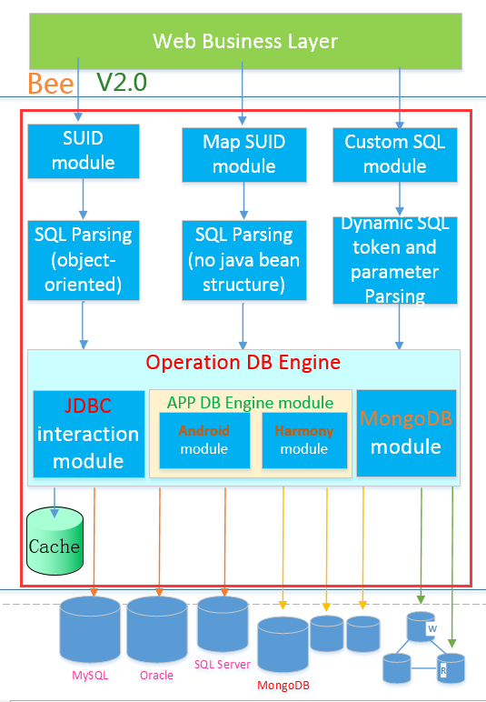
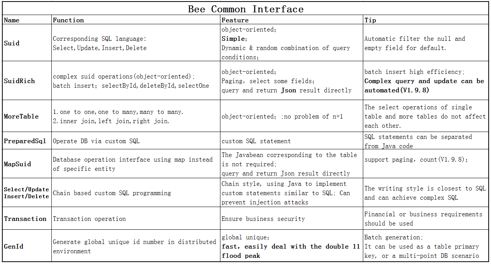

Bee
=========
**Easy for Stronger.**   
**Bee** is an ORM framework.   
**Bee** is an easy and high efficiency ORM framework.  
**Coding Complexity is O(1),it means that Bee will do the Dao for you**.  
**You don't need to write the Dao by yourself anymore**.Help you to focus more on the development of business logic.  
**Good Feature:**  AI, Timesaving/Tasteful, Easy, Automatic (**AiTeaSoft Style**)   

## **Good News:**  
Newest version is:**Bee V2.4.0 LTS**  

Sharding target: It is mainly transparent to business development and coding, with only a little sharding config.  
#### [Quick Start:Shardign better example](guide/Quick-start-Sharding.md) 


**Bee** see:  
https://github.com/automvc/bee  
bee-ext:  
https://github.com/automvc/bee-ext  

## [中文介绍](../../../bee/blob/master/README_CN.md)  
[点击链接可查看中文介绍](../../../bee/blob/master/README_CN.md)  

## Requirement  
#### Bee jdk1.8+

## Feature & Function: 

**Easy to use**:  
* 1.Simple interface, convenient to use. The Suid interface provides four object-oriented methods corresponding to the SQL language's select, update, insert, and delete operations.  
* 2.By using Bee, you no longer need to write separate DAO code. You can directly call Bee's API to perform operations on the database.  
* 3.Convention-over-configuration: Javabean can no annotation, no xml.  
* 4.Intelligent automatic filtering of null and empty string properties in entities eliminates the need for writing code to check for non-null values.  
* 5.Easily implement partial field queries and native statement pagination.  
* 6.Supports returning query results in JSON format; supports chaining.  
* 7.Supports Sharding, both database and table Sharding; database-only Sharding; table-only Sharding; and read-write separation. This functionality is transparent to existing code and does not require additional coding.  
* 8.Easily extendable with multiple database support (MySQL, MariaDB, Oracle, H2, SQLite, PostgreSQL, SQL Server, Access, Kingbase, Dameng, etc.), and theoretically supports any database supported by JDBC. Additionally, supports Android and Harmony.  
* 9.Additional database pagination support for: MsAccess, Cubrid, HSQL, Derby, Firebird, etc.
* 10.Multiple databases can be used simultaneously (e.g., MySQL, Oracle, SQL Server).  

**Automatic, powerful**:  
* 11.Dynamic/arbitrary combination of query conditions without the need to prepare DAO interfaces in advance. New query requirements can be handled without modifying or adding interfaces.  
* 12.Supports transactions, using the same connection for multiple ORM operations, FOR UPDATE, batch processing, executing native SQL statements, and stored procedures.  
* 13.Supports object-oriented complex queries, multi-table queries (no N+1 problem), and supports one-to-one, one-to-many, many-to-one, and many-to-many relationships. The result structure can differ based on whether the sub-table uses List;multi-table association update, insert, and delete(2.1.8).  
* 14.MongoDB ORM and support for MongoDB Sharding.  
* 15.Supports register, interceptor, multi-tenancy, and custom TypeHandlers for handling ResultSet results in queries. SetParaTypeConvert converts PreparedStatement parameter types.  
* 16.Custom dynamic SQL tags, such as @in, @toIsNULL1, @toIsNULL2, <if isNotNull>, <if isNotBlank>. Allows dynamic SQL, converting lists into statements like in (1,2,3) without requiring foreach loops. Batch insertion also does not require foreach.  
* 17.Complex query can be automatically parsed by the frontend and backend.  
* 18.L1 cache, simple in concept and powerful in function; L1 cache can also be fine tuned like the JVM; Support updatable long-term cache list and update configuration table without restart. Inherently resistant to cache penetration. L2 cache extension support; Redis L2 cache support.  
* 19.No third-party plugin dependencies; can be used with zero configuration.  
* 20.High performance: close to the speed of JDBC; small file size: Bee V1.17 is only 502k, V2.1 is only 827k.  
**Assist function**:  
* 21.Additional features: 21. Provides a naturally simple solution for generating distributed primary keys: generates globally unique, monotonically increasing (within a worker ID) numeric IDs in a distributed environment.  
* 22.Supports automatic generation of Javabean corresponding to tables(support Swagger), creating tables based on Javabean, and automatically generating backend Javaweb code based on templates. Can print executable SQL statements without placeholders for easy debugging. Supports generating SQL scripts in JSON format.  
* 23.Supports reading Excel files and importing data into the database; simple operations. Supports generating database tables from Excel configurations.  
* 24.Stream tool class StreamUtil;DateUtil date conversion, judge date format, calculate age.  
* 25.Rich annotation support: PrimaryKey, Column, Datetime, Createtime, Updatetime; JustFetch, ReplaceInto (MySQL), Dict, DictI18n,GridFs, etc.  
* 26.Use entity name _F (automatically generated) to reference entity field names, e.g., Users_F.name or in SuidRichExt interface using the format Users::getName.  

## Newest main Function
### **V2.4.0**  

1. Chaing SQL programming supports placeholder precompilation to prevent injection attacks  
2. Do not cache if no table name is specified  
3. Add a default date sharding implementation for Calculate, and add a custom sharding implementation example  
4. Support ElasticSearch(7.x) ORM query  
5. PreparedSql support set table name for enhance relative cache  
6. MongoDB gen Javabean support gen comment  

7. the Sharding template method class uses finally to handle context recycling  
8. MapSql(MapSuid)supports using Condition to implement more complex where conditions, with updateSet set values  
MapSql add methods: public void where(Condition condition);  
                    public void updateSet(Condition condition);  
9. add ConditionExt to support the use of entity::getName to reference property  
  ConditionExt support Condition no need hard code the field name  
10. add ChainSqlFactory  

11. add select Result Assembler  
12. MoreTable add methods:selectWithFun,count  
13. MoreTable add method List<String[]> selectString(T entity, Condition condition)  
14. enhance MoreTable update  

15. support property style sharding config  
16. MoreTable support selectJson  
17. GenBean support java.time.LocalDateTime  
18. fixed bug: GenConfig baseDir default value support Linux env  
19. Suid support java.time.LocalDateTime type  
20. TO_DATE for Oracle filter the record in SQL where part  

21. Fixed bug: MoreTable single insertion, automatic value setting before doBeforePasreEntity
   InsertAndReturnId in sharding mode need setInitIdByAuto > doBeforePasreEntity  
   InsertAndReturnId: The pkName passed in should be converted to column name  
22. enhance:  
    When inserting multiple tables, if there are no child tables, insert is used for inserting the main table  
   File generation, add backup of existing files function  
   TranHandler throws the received exception to the upper level  
23. support pgsql json/jsonb, but in where part, need write the pgsql special sql  
24. Improve the sharding function  

## [Function Detail](../../../bee/blob/master/Changed_Log.md)  
[click for:  Function Detail](../../../bee/blob/master/Changed_Log.md)  

## Bee Support Database list:	
1.MySQL  
2.Oracle  
3.SQL Server  
4.MariaDB  
5.H2  
6.SQLite  
7.PostgreSQL  
8.MS Access  
9.Kingbase  
10.DM  
11.OceanBase  
12.Cubrid,HSQL,Derby,Firebird  
13.Other DB that support JDBC  

NOSQL:  
14.Mongodb  
15.ElasticSearch  
16.Cassandra  

Mobile environment (database): 
17.Android  
18.Harmony  

## ORM Compare	
### Compare in JDBC	

[ORM-Compare (More Detail)](../../../orm-compare)  

Test Evn : Local windows.  
DB: MySQL (Version 5.6.24).  
Test point: Batch Insert;Paging Select; Transaction(update and select).  

  

<table cellspacing="0" cellpadding="0">
  <col width="62" />
  <col width="69" />
  <col width="64" />
  <col width="69" span="2" />
  <col width="96" />
  <tr height="19">
    <td colspan="6" height="19" width="429"><div align="center">Batch Insert(unit: ms)</div></td>
  </tr>
  <tr height="19">
    <td height="19">　</td>
    <td>5k</td>
    <td>1w</td>
    <td>2w</td>
    <td>5w</td>
    <td>10w</td>
  </tr>
  <tr height="19">
    <td height="19">Bee</td>
    <td align="right">529.00 </td>
    <td align="right">458.33 </td>
    <td align="right">550.00 </td>
    <td align="right">1315.67 </td>
    <td align="right">4056.67 </td>
  </tr>
  <tr height="19">
    <td height="19">MyBatis</td>
    <td align="right">1193</td>
    <td align="right">713</td>
    <td align="right">1292.67 </td>
    <td align="right">1824.33 </td>
    <td>Exception</td>
  </tr>
</table>

<p>&nbsp;</p>
<table cellspacing="0" cellpadding="0">
  <col width="62" />
  <col width="69" />
  <col width="64" />
  <col width="69" span="2" />
  <col width="96" />
  <tr height="19">
    <td colspan="6" height="19" width="429"><div align="center">Paging Select(unit: ms)</div></td>
  </tr>
  <tr height="19">
    <td height="19">　</td>
    <td align="right">20</td>
    <td align="right">50</td>
    <td align="right">100</td>
    <td align="right">200</td>
    <td align="right">500</td>
  </tr>
  <tr height="19">
    <td height="19">Bee</td>
    <td align="right">17.33 </td>
    <td align="right">58.67 </td>
    <td align="right">52.33 </td>
    <td align="right">38.33 </td>
    <td align="right">57.33 </td>
  </tr>
  <tr height="19">
    <td height="19">MyBatis</td>
    <td align="right">314.33 </td>
    <td align="right">446.00 </td>
    <td align="right">1546.00 </td>
    <td align="right">2294.33 </td>
    <td align="right">6216.67 </td>
  </tr>
</table>

<p>&nbsp;</p>
<table cellspacing="0" cellpadding="0">
  <col width="62" />
  <col width="69" />
  <col width="64" />
  <col width="69" span="2" />
  <col width="96" />
  <tr height="19">
    <td colspan="6" height="19" width="429"><div align="center">Transaction(update and select) (unit: ms)</div></td>
  </tr>
  <tr height="19">
    <td height="19">　</td>
    <td align="right">20</td>
    <td align="right">50</td>
    <td align="right">100</td>
    <td align="right">200</td>
    <td align="right">500</td>
  </tr>
  <tr height="19">
    <td height="19">Bee</td>
    <td align="right">1089.00 </td>
    <td align="right">70.00 </td>
    <td align="right">84.00 </td>
    <td align="right">161.33 </td>
    <td align="right">31509.33 </td>
  </tr>
  <tr height="19">
    <td height="19">MyBatis</td>
    <td align="right">1144</td>
    <td align="right">35</td>
    <td>79.67 </td>
    <td align="right">146.00 </td>
    <td align="right">32155.33 </td>
  </tr>
</table>

**Bee need files**   
orm\compare\bee\service\BeeOrdersService.java	

**MyBatis need files**  
orm\compare\mybatis\service\MybatisOrdersService.java  
orm\compare\mybatis\dao\OrdersDao.java  
orm\compare\mybatis\dao\OrdersMapper.java  
orm\compare\mybatis\dao\impl\OrdersDaoImpl.java  

common,Javabean and Service interface:  
Orders.java  
OrdersService.java  

### Bee application in App Compare  

**Performance comparison data of Bee application in app development**  
Operate 10000 records, and the use time comparison is as follows.  

<table cellpadding="0" cellspacing="0">
  <col width="50" />
  <col width="90" />
  <col width="74" />
  <col width="76" />
  <tr height="19">
    <td height="19" colspan="4" ><div align="center">Operate 10000 records(unit: ms)</div></td>
  </tr>
  <tr height="19">
    <td height="19" >　</td>
    <td align="right">insert</td>
    <td align="right">query</td>
    <td align="right">delete</td>
  </tr>
  <tr height="19">
    <td height="19">greenDao(Android)</td>
    <td align="right">104666</td>
    <td align="right">600 </td>
    <td align="right">47 </td>
  </tr>
  <tr height="19">
    <td height="19">Bee(Android 8.1)</td>
    <td align="right">747</td>
    <td align="right">184</td>
    <td align="right">25 </td>
  </tr>
  <tr height="19">
    <td height="19">Bee(HarmonyOS P40 Pro simulator)</td>
    <td align="right">339</td>
    <td align="right">143</td>
    <td align="right">2 </td>
  </tr>
</table>


Quick Start:
=========	
## 1. Add Bee   
#### 1.1 if it is a maven project,add the following dependency  

```xml
       <dependency>
	      <groupId>org.teasoft</groupId>
	      <artifactId>bee-all</artifactId>
	      <version>2.4.0</version>
        </dependency>
		
	    <!-- Mysql config.You need change it to the real database config. -->
		<dependency>
			<groupId>mysql</groupId>
			<artifactId>mysql-connector-java</artifactId>
			<version>5.1.47</version>
			<scope>runtime</scope>
		</dependency>
```

Gradle

```xml
implementation group: 'org.teasoft', name: 'bee-all', version: '2.4.0'
//Gradle(Short)
implementation 'org.teasoft:bee-all:2.4.0'
```

#### 1.2  Of course, can download the jar file directly  

## 2. Create the database and the table  

eg:  
Create one database,default name is bee.  
Create the tables and init the data by run the [init-data(user-orders)-mysql.sql](../../../bee-exam/blob/master/src/main/resources/init-data(user-orders)-mysql.sql) file(it is mysql sql script).  

## 3. Update the database configuration in bee.properties if need  
If no the bee.properties file, you can create it by yourself.

\#bee.databaseName=MySQL  
bee.db.dbName=MySQL  
bee.db.driverName = com.mysql.jdbc.Driver  
\#bee.db.url =jdbc:mysql://localhost:3306/bee?characterEncoding=UTF-8  
bee.db.url =jdbc:mysql://127.0.0.1:3306/bee?characterEncoding=UTF-8&useSSL=false  
bee.db.username = root  
bee.db.password =  

\#print log  
bee.osql.showSQL=true  
bee.osql.showSql.showType=true  
bee.osql.showSql.showExecutableSql=true  
\# since 2.1.7 sqlFormat=true,will format the executable sql
bee.osql.showSql.sqlFormat=false

\#log4j>slf4j>log4j2>androidLog>harmonyLog>systemLogger>fileLogger>noLogging>jdkLog>commonsLog  
bee.osql.loggerType=systemLogger  

## 4. The Javabean Orders reference as below:  
[Orders(Javabean)](../../../bee-exam/blob/master/src/main/java/org/teasoft/exam/bee/osql/entity/Orders.java)  
[Auto Genernate Javabean](../../../bee-exam/blob/master/src/main/java/org/teasoft/exam/bee/osql/autogen/GenBeanExam.java)  

## 5. Run the following java code  

```java
		
import java.math.BigDecimal;
import java.util.List;

import org.teasoft.bee.osql.BeeException;
import org.teasoft.bee.osql.Suid;
import org.teasoft.honey.osql.core.BeeFactoryHelper;
import org.teasoft.honey.osql.core.Logger;

/**
 * @author Kingstar
 * @since 1.0
 */
public class SuidExamEN {

	public static void main(String[] args) {

		try {
			Suid suid = BeeFactoryHelper.getSuid();

			Orders orders1 = new Orders();//need gen the Javabean
			orders1.setId(100001L);
			orders1.setName("Bee(ORM Framework)");

			List<Orders> list1 = suid.select(orders1); // 1. select
			for (int i = 0; i < list1.size(); i++) {
				Logger.info(list1.get(i).toString());
			}

			orders1.setName("Bee(ORM Framework)");
			int updateNum = suid.update(orders1); //2. update
			Logger.info("update record:" + updateNum);

			Orders orders2 = new Orders();
			orders2.setUserid("bee");
			orders2.setName("Bee(ORM Framework)");
			orders2.setTotal(new BigDecimal("91.99"));
			orders2.setRemark(""); // empty String test

			int insertNum = suid.insert(orders2); // 3. insert
			Logger.info("insert record:" + insertNum);

			int deleteNum = suid.delete(orders2); // 4. delete
			Logger.info("delete record:" + deleteNum);
		} catch (BeeException e) {
			Logger.error("In SuidExamEN (BeeException):" + e.getMessage());
			//e.printStackTrace();
		} catch (Exception e) {
			Logger.error("In SuidExamEN (Exception):" + e.getMessage());
			//e.printStackTrace();
		}
	}

}
// notice: this is just a simple sample. Bee suport transaction,paging,complicate select,slect json,and so on.	

```


## [Quick Start : Bee + Harmony](guide/Quick-start-for-Harmony.md) 

## [Quick Start : Bee + Android](guide/Quick-start-for-Android.md) 

## Use Bee in Android Environment    
### 1.bee.properties    

```properties
bee.db.isAndroid=true
bee.db.androidDbName=account.db
bee.db.androidDbVersion=1
bee.osql.loggerType=androidLog
#turn on query result field type conversion, and more types will be supported
bee.osql.openFieldTypeHandler=true

#If you are allowed to delete and update the whole table, you need to remove the comments
#bee.osql.notDeleteWholeRecords=false
#bee.osql.notUpdateWholeRecords=false
```

### 2.implement tables that need to be created and updated when app installation and upgrade	

```java
public class YourAppCreateAndUpgrade implements CreateAndUpgrade{
	@Override
	public void onCreate() {
//		You can create tables in an object-oriented way
		Ddl.createTable(new Orders(), false);
		Ddl.createTable(new TestUser(), false);
	}

	@Override
	public void onUpgrade(int oldVersion, int newVersion) {
		if(newVersion==2) {
			Ddl.createTable(new LeafAlloc(), true);
			Log.i("onUpgrade", "你在没有卸载的情况下，在线更新到版本:"+newVersion);
		}
	}
}


```
### 3.Register YourAppCreateAndUpgrade and Android context to Bee	
Configure android:name to BeeApplication in AndroidManifest.xml file.	

```java
package com.aiteasoft.util;

import org.teasoft.bee.android.CreateAndUpgradeRegistry;
import org.teasoft.beex.android.ApplicationRegistry;

public class BeeApplication extends Application {
    private static Context context;
    @Override
    public void onCreate() {
       ApplicationRegistry.register(this);//注册上下文
       CreateAndUpgradeRegistry.register(YourAppCreateAndUpgrade.class);
    }
 }
 
// 并在AndroidManifest.xml,配置android:name为BeeApplication 
 <application
        android:icon="@drawable/appicon"
        android:label="@string/app_name"
         android:name="com.aiteasoft.util.BeeApplication"
       >
```

### 4.Java operation SQLite database is similar to JavaWeb	

```java
Suid suid=BF.getSuid();
List<Orders> list = suid.select(new Orders()); 
```

### 5.Bee application in App Compare	
**Performance comparison data of Bee application in app development**  
Operate 10000 records, and the use time comparison is as follows.  

<table cellpadding="0" cellspacing="0">
  <col width="50" />
  <col width="90" />
  <col width="74" />
  <col width="76" />
  <tr height="19">
    <td height="19" colspan="4" ><div align="center">Operate 10000 records(unit: ms)</div></td>
  </tr>
  <tr height="19">
    <td height="19" >　</td>
    <td align="right">insert</td>
    <td align="right">query</td>
    <td align="right">delete</td>
  </tr>
  <tr height="19">
    <td height="19">greenDao(Android)</td>
    <td align="right">104666</td>
    <td align="right">600 </td>
    <td align="right">47 </td>
  </tr>
  <tr height="19">
    <td height="19">Bee(Android 8.1)</td>
    <td align="right">747</td>
    <td align="right">184</td>
    <td align="right">25 </td>
  </tr>
  <tr height="19">
    <td height="19">Bee(HarmonyOS P40 Pro simulator)</td>
    <td align="right">339</td>
    <td align="right">143</td>
    <td align="right">2 </td>
  </tr>
</table>


### [More example/test case](../../../bee-exam/)	

### [Bee+Spring-boot Demo](../../../bee-starter-demo/)	

## Bee Architecture  
**V2.1**  
  

## Bee Common Interface  
  

Rapid application development:
=========	
**Let Java more quicker programming than php and Rails.**  

**Faster development of new combinations for Java Web：**  
[Bee+Spring+SpringMVC](../../../../aiteasoft/bee-spring-springmvc)  

**Faster development of new combinations for Spring Cloud microservices：**  
[Bee + Spring Boot](../../../bee-springboot)  

## KmCoding
[Rapid Application Code Generation Platform](https://www.kmcoding.com)--AiTea Soft made in China!  

[Generate code automatically](../../../gencode)  

...  

App Demo:
=========	
### **HarmonyOS application Demo with ORM Bee：**  
[Bee + HarmonyOS](../../../../aiteasoft/HarmonyOS-ORM-Bee-Demo)  

[Bee + Android](guide/Quick-start-for-Android.md)  

Other Document:
=========	
### API-DOC  
API-V1.17(Newest) SourceCode contain bee-1.17 CN & EN API,bee-1.17 CN SourceCode  

[wiki Document](../../../bee/wikis)  

[CSDN: ORM Bee Document](https://blog.csdn.net/abckingaa/article/details/121664398)

### Technical Support
**The use of Enterprise Edition, professional technical support and solution consultation are provided by the following companies:**  
**[Shenzhen Caifeng software](https://www.aiteasoft.com)**  
(Enterprises willing to join in, please contact us!)  

Contact & Welcome:
=========	
#### Author's email:    honeysoft@126.com  
#### If you have any problem on bee, please let me know kindly! Thank you, so much!  
#### ORM QQ Group: 992650213     WeChat:AiTeaSoft  
#### At the same time, welcome you to join Bee team create a better future. 