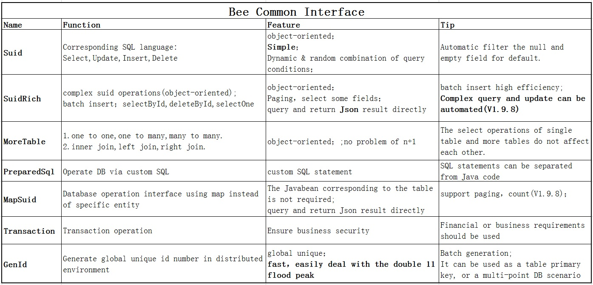

Bee
=========
**Easy for Stronger.**   
**Bee** is an ORM framework.   
**Bee** is an easy and high efficiency ORM framework.    
**Coding Complexity is O(1),it means that Bee will do the Dao for you**.  
**You don't need to write the Dao by yourself anymore**.Help you to focus more on the development of business logic.  
**Good Feature:**  AI, Timesaving/Tasteful, Easy, Automatic (**AiTeaSoft Style**)   
**Bee** see:  
https://github.com/automvc/bee  
or:  
https://gitee.com/automvc/bee  

## [中文介绍](../../../bee/blob/master/README_CN.md)  
[点击链接可查看中文介绍](../../../bee/blob/master/README_CN.md)  

## Requirement  
jdk1.7+

## Feature & Function: 

**Support many Database**(MySQL,MariaDB,Oracle,H2,SQLite,PostgreSQL,SQL Server and so on) and easily extend。 
**Good performance, close to the speed of JDBC; Small files：Bee V1.8 jar 217k**, **V1.9.5 jar,315k, V1.9.8 jar 310k**。  

**V1.0**  
Single entity(table) Suid (select,update,insert,delete) object-oriented operation.  
Automatically generate the Javabean via DB table or view.  
Convention-over-configuration:Javabean no annotation,no xml.  
Automatically mapping the table column and the Javabean field.  
Javabean support the raw type:int,double,and so on.  
PreparedStatement support.  
Procedure support.  
Native SQL support.  
Batch operate support.  
Transaction support.  
Automatic filter the null and empty field for default.  
MAX,MIN,SUM,AVG,COUNT support.  
Order by,Paging.  
Select some field.  
Dynamic & random combination of query conditions,no need to prepare the interface in advance; new query requirements, no need to change the query interface.  
All Suid(select,update,insert,delete) operation use the same Bee interface,no longer need any new dao interface.  
Users/Developer only need to pay attention to the Bee interface.  

......

**V1.11**  
V1.11.0.1.1(**2022 New Year**)  
SuidRich add method:  
  public <T> long insertAndReturnId(T entity,IncludeType includeType);  
PreparedSql add method:  
  public <T> List<T> select(String sql,T returnType);  
add annotation PrimaryKey  
MapSqlKey support PrimaryKey  
BF is shortcut for BeeFactoryHelper  
Enhance:config info add trim() about multi-DataSource Write/Read  
fix a bug for naming transfer  

V1.11.0.2.1(**2022 Spring Festival**)  
add function: Interceptor、multi-tenant  
add Interceptor,InterceptorChain  
add DefaultInterceptor,CommInterceptorChain,DefaultInterceptorChain  

V1.11.0.2.4(**2022 Beijing Winter Olympics**)  
level tow ext cache support  
Redis cache support  
add BeeExtCache,DefaultBeeExtCache  
add BeeExtRedisCache  

V1.11.0.2.15(**2022 the Lantern Festival**)  
add annotation:Datetime,Createtime,Updatetime;JustFetch  
add support Jndi DataSource  
check MapSqlKey value 
 
V1.11.0.2.20(**Honor**)  
Optimize use different Database Type at same time(multi-Ds)  
Support use differnt type Database at the same time(eg:use Mysql,Oracle,SQL Server at same time)  
PreparedSql,MapSuid support Interceptor  
Suid,PreparedSql,MapSuid support get DataSource,get InterceptorChain  
Suid,PreparedSql,MapSuid,MoreTable add method:setDataSourceName,getDataSourceName,getInterceptorChain  
add Annotation:  
AnnotationHandler,AutoSetString  
Desensitize    
ReplaceInto,MySQL replace into  
MultiTenancy  
BeforeReturnAnnotationHandler,AbstractDictI18nDefaultHandler  
Dict  
DictI18n  

V1.11.0.2.28  (**Special Day**)  
add ShardingStruct prepare for sharding.  
add Column annotation support to extend mapping column and Javabean field name.  
support custom TypeHandler,and process the ResultSet.  
PreparedSql custom sql support more table select,and return more table struct Javabean.  
fixed bug:  
More table self association query of the same entity forbid multi-self-cycles  

V1.11.0.3.8  (**Lady First**)  
add SetParaTypeConvert for convert PreparedStatement parameter.  
Javabean use java.util.Date type for SUID compatibility processing.  
SQLite get the timestamp result for conversion.  
The Json field of DB is automatically converted to the attribute marked with Json annotation of Javabean(Javabean structure corresponding to Json). 

## [Function Detail](../../../bee/blob/master/Changed_Log.md)  
[click for:  Function Detail](../../../bee/blob/master/Changed_Log.md)  

## ORM Compare	

[ORM-Compare (More Detail)](../../../orm-compare)  

Test Evn : Local windows.  
DB: MySQL (Version 5.6.24).  
Test point: Batch Insert;Paging Select; Transaction(update and select).  

  

<table cellspacing="0" cellpadding="0">
  <col width="62" />
  <col width="69" />
  <col width="64" />
  <col width="69" span="2" />
  <col width="96" />
  <tr height="19">
    <td colspan="6" height="19" width="429"><div align="center">Batch Insert(unit: ms)</div></td>
  </tr>
  <tr height="19">
    <td height="19">　</td>
    <td>5k</td>
    <td>1w</td>
    <td>2w</td>
    <td>5w</td>
    <td>10w</td>
  </tr>
  <tr height="19">
    <td height="19">Bee</td>
    <td align="right">529.00 </td>
    <td align="right">458.33 </td>
    <td align="right">550.00 </td>
    <td align="right">1315.67 </td>
    <td align="right">4056.67 </td>
  </tr>
  <tr height="19">
    <td height="19">MyBatis</td>
    <td align="right">1193</td>
    <td align="right">713</td>
    <td align="right">1292.67 </td>
    <td align="right">1824.33 </td>
    <td>Exception</td>
  </tr>
</table>

<p>&nbsp;</p>
<table cellspacing="0" cellpadding="0">
  <col width="62" />
  <col width="69" />
  <col width="64" />
  <col width="69" span="2" />
  <col width="96" />
  <tr height="19">
    <td colspan="6" height="19" width="429"><div align="center">Paging Select(unit: ms)</div></td>
  </tr>
  <tr height="19">
    <td height="19">　</td>
    <td align="right">20</td>
    <td align="right">50</td>
    <td align="right">100</td>
    <td align="right">200</td>
    <td align="right">500</td>
  </tr>
  <tr height="19">
    <td height="19">Bee</td>
    <td align="right">17.33 </td>
    <td align="right">58.67 </td>
    <td align="right">52.33 </td>
    <td align="right">38.33 </td>
    <td align="right">57.33 </td>
  </tr>
  <tr height="19">
    <td height="19">MyBatis</td>
    <td align="right">314.33 </td>
    <td align="right">446.00 </td>
    <td align="right">1546.00 </td>
    <td align="right">2294.33 </td>
    <td align="right">6216.67 </td>
  </tr>
</table>

<p>&nbsp;</p>
<table cellspacing="0" cellpadding="0">
  <col width="62" />
  <col width="69" />
  <col width="64" />
  <col width="69" span="2" />
  <col width="96" />
  <tr height="19">
    <td colspan="6" height="19" width="429"><div align="center">Transaction(update and select) (unit: ms)</div></td>
  </tr>
  <tr height="19">
    <td height="19">　</td>
    <td align="right">20</td>
    <td align="right">50</td>
    <td align="right">100</td>
    <td align="right">200</td>
    <td align="right">500</td>
  </tr>
  <tr height="19">
    <td height="19">Bee</td>
    <td align="right">1089.00 </td>
    <td align="right">70.00 </td>
    <td align="right">84.00 </td>
    <td align="right">161.33 </td>
    <td align="right">31509.33 </td>
  </tr>
  <tr height="19">
    <td height="19">MyBatis</td>
    <td align="right">1144</td>
    <td align="right">35</td>
    <td>79.67 </td>
    <td align="right">146.00 </td>
    <td align="right">32155.33 </td>
  </tr>
</table>

**Bee need files**   
orm\compare\bee\service\BeeOrdersService.java	

**MyBatis need files**  
orm\compare\mybatis\service\MybatisOrdersService.java  
orm\compare\mybatis\dao\OrdersDao.java  
orm\compare\mybatis\dao\OrdersMapper.java  
orm\compare\mybatis\dao\impl\OrdersDaoImpl.java  

common,Javabean and Service interface:  
Orders.java  
OrdersService.java  

Quick Start:
=========	
## 1. Add Bee   
#### 1.1 if it is a maven project,add the following dependency  

```xml
		<dependency>
			<groupId>org.teasoft</groupId>
			<artifactId>bee</artifactId>
			<version>1.9.8</version>
		</dependency>
		<dependency>
			<groupId>org.teasoft</groupId>
			<artifactId>honey</artifactId>
			<version>1.9.8</version>
		</dependency>
		<!--for log framework,Excel(poi) -->
		<dependency>
			<groupId>org.teasoft</groupId>
			<artifactId>bee-ext</artifactId>
			<version>1.9.8</version>
		</dependency>
```

#### 1.2  Of course, can download the jar file directly  

## 2. Create the database and the table  

eg:  
Create one database,default name is bee.  
Create the tables and init the data by run the [init-data(user-orders)-mysql.sql](../../../bee-exam/blob/master/src/main/resources/init-data(user-orders)-mysql.sql) file(it is mysql sql script).  

## 3. Update the database configuration in bee.properties if need  
If no the bee.properties file, you can create it by yourself.

//#bee.databaseName=MySQL  
bee.db.dbName=MySQL  
bee.db.driverName = com.mysql.jdbc.Driver  
bee.db.url =jdbc:mysql://localhost:3306/bee?characterEncoding=UTF-8  
bee.db.username = root  
bee.db.password =  

## 4. The Javabean Orders reference as below:  
[Orders(Javabean)](../../../bee-exam/blob/master/src/main/java/org/teasoft/exam/bee/osql/entity/Orders.java)  
[Auto Genernate Javabean](../../../bee-exam/blob/master/src/main/java/org/teasoft/exam/bee/osql/autogen/GenBeanExam.java)  

## 5. Run the following java code  

```java
		
import java.math.BigDecimal;
import java.util.List;

import org.teasoft.bee.osql.BeeException;
import org.teasoft.bee.osql.Suid;
import org.teasoft.honey.osql.core.BeeFactoryHelper;
import org.teasoft.honey.osql.core.Logger;

/**
 * @author Kingstar
 * @since 1.0
 */
public class SuidExamEN {

	public static void main(String[] args) {

		try {
			Suid suid = BeeFactoryHelper.getSuid();

			Orders orders1 = new Orders();//need gen the Javabean
			orders1.setId(100001L);
			orders1.setName("Bee(ORM Framework)");

			List<Orders> list1 = suid.select(orders1); // 1. select
			for (int i = 0; i < list1.size(); i++) {
				Logger.info(list1.get(i).toString());
			}

			orders1.setName("Bee(ORM Framework)");
			int updateNum = suid.update(orders1); //2. update
			Logger.info("update record:" + updateNum);

			Orders orders2 = new Orders();
			orders2.setUserid("bee");
			orders2.setName("Bee(ORM Framework)");
			orders2.setTotal(new BigDecimal("91.99"));
			orders2.setRemark(""); // empty String test

			int insertNum = suid.insert(orders2); // 3. insert
			Logger.info("insert record:" + insertNum);

			int deleteNum = suid.delete(orders2); // 4. delete
			Logger.info("delete record:" + deleteNum);
		} catch (BeeException e) {
			Logger.error("In SuidExamEN (BeeException):" + e.getMessage());
			e.printStackTrace();
		} catch (Exception e) {
			Logger.error("In SuidExamEN (Exception):" + e.getMessage());
			e.printStackTrace();
		}
	}

}
// notice: this is just a simple sample. Bee suport transaction,paging,complicate select,slect json,and so on.	

```

#### [More example/test case](../../../bee-exam/)	

#### [Bee+Spring-boot Demo](../../../bee-starter-demo/)	

### Bee Common Interface  
  

Rapid application development:
=========	
**Let Java more quicker programming than php and Rails.**  

**Faster development of new combinations for Java Web：**  
[Bee+Spring+SpringMVC](../../../../aiteasoft/bee-spring-springmvc)  

**Faster development of new combinations for Spring Cloud microservices：**  
[Bee + Spring Boot](../../../bee-springboot)  

...  

Other Document:
=========	
[wiki Document](../../../bee/wikis)  

[CSDN: ORM Bee Document](https://blog.csdn.net/abckingaa/article/details/121664398)
  
Contact & Welcome:
=========	
#### Author's email:    honeysoft@126.com  
#### If you have any problem on bee, please let me know kindly! Thank you, so much!  
#### ORM QQ Group: 992650213     WeChat:AiTeaSoft  
#### At the same time, welcome you to join Bee team create a better future. 