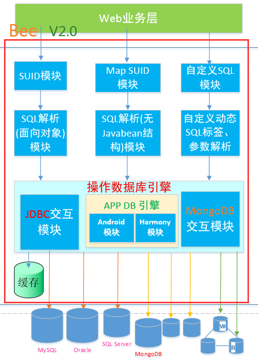

Bee
=========
## 好消息:  
**Bee 2.0 Sharding分片 功能,登场了。自此，Bee有了完整的分库分表功能。**  
**Bee 2.0 起,还支持MongoDB,MS Access。**  
请查看  
[2.0-sharding-dev 分支 ](../../../bee/tree/2.0-sharding-dev)  
[2.1分支   JDBC Sharding+MongoDB](../../../bee/tree/2.1)  

Sharding分片目标:对业务开发透明,编码透明,只加少量分片配置即可实现分片功能.  
#### [快速开始:Shardign最佳实践参考实例](guide/Quick-start-Sharding_CN.md) 

#### 工欲善其事必先利其器！——《论语·卫灵公》  
#### 为适应互联网时代软件需求量大,需求变更频繁,性能要求高等要求,ORM Bee应运而生!

**Bee**，互联网新时代的Java ORM框架，更快、更简单、更自动，开发速度快，运行快，更智能!  
**Bee**，一个简单，易用，功能强大(编码少、开发速度快，运行快）的 JAVA ORM 框架。  
**Bee简单易用**：单表操作、多表关联操作，可以不用写sql,极少语句就可以完成SQL操作；**概念简单**,10分钟即可入门。  
**Bee功能强大**：复杂查询也支持向对象方式，分页查询性能更高，一级缓存即可支持个性化优化；具有分布式特性。高级要求，还可以方便自定义SQL语句。运行速度接近直接用JDBC的速度。  
**Bee功能丰富**：同时支持JDBC(比如JavaWeb),Android和Harmony；支持Sharding分片；支持多种关系型数据库(MySQL,MariaDB,Oracle,H2,SQLite,PostgreSQL,SQL Server,Access,金仓,达梦等)，还支持NoSQL的Cassandra,Mongodb等  
**如果说Mybatis在Hibernate之后不是重复造轮子,那Bee在Hibernate和Mybatis之后也不会是重复造轮子!**  
择其优点，避其缺点，此外，还加有自己的优点！  

#### 磨刀不误砍柴工！    Bee连磨刀的时间都帮你省了。  
**Bee** 是一个具有人工智能(**AI**)特性，**省时/优雅、简易、自动**( **AiTea:** Timesaving/Tasteful, Easy, Automatic) 的ORM软件框架(AiTeaSoft)(IT-->AiTea 的思维转变!)。
  
Bee是一种更接近SQL语言思维的ORM框架，  
一种开发速度和开发成本都不比Php,Ruby on Rail差的Java ORM框架，  
而且它的编码复杂度是O(1)，即用了Bee，**无论多少个表**,你都可以不用另外再写dao代码；**让你可以更专注业务逻辑的开发**。  

**Bee** 网址:  
https://github.com/automvc/bee  
**Bee在gitee** 的网址:  
https://gitee.com/automvc/bee  
bee-ext:  
https://github.com/automvc/bee-ext  

## 环境要求  
#### Bee jdk1.7+
#### Bee-Ext(V2.0) jdk1.8+

## Bee主要功能特点介绍：  
**Bee概念简单**(10分钟即可入门)、功能强大。  
Bee **简化了与DB交互的编码**工作量。连接，事务都可以由Bee框架负责管理。  
简单易用,文件小,性能好;同时支持**JDBC(比如JavaWeb),Android和Harmony**。  
### 省时,开发速度快
#### 简单易用
* 1.**接口简单，使用方便**。Suid接口中对应SQL语言的select,update,insert,delete操作提供**4个同名方法**。  
* 2.使用了Bee,你可以不用再另外编写dao代码，直接调用Bee的api即可完成对DB的操作。  
* 3.**约定优于配置**:Javabean没有注解,也不需要xml映射文件,只是纯的Javabean即可,甚至get,set方法不用也可以。  
* 4.**智能化自动过滤**null和空字符串，不再需要写判断非空的代码。  
* 5.支持**只查询一部分字段**。   
**Bee可用于Android和Harmony环境访问SQLite数据库,专门对此作了优化(V1.17)**
#### 自动,功强强大
* 6.**动态/任意组合**查询条件,不需要提前准备dao接口,有新的查询需求也不用修改或添加接口。  
* 7.支持原生SQL排序, **原生语句分页**(不需要将全部数据查出来)。  
* 8.支持**直接返回Json**格式查询结果; 链式编程。  
* 9.支持**事务**、多个ORM操作使用同一连接、**for update**，支持**批处理**操作，支持原生SQL(**自定义sql**语句)，支持**存储过程**。
* 10.支持面向对象方式复杂查询、**多表查询**(无n+1问题; 支持：一对一,一对多,多对一,多对多;返回结果根据子表是否使用List有两种呈现结构)。 
* 11.**一级缓存**，概念简单，功能强大；一级缓存也可以**像JVM一样进行细粒度调优**；**支持可更新的长久缓存列表**，更新配置表，**不需要重启**。天生抵御缓存穿透 。 
    **二级缓存扩展支持;内置Redis二级缓存支持**。  
* 12.表名与实体名、字段名与属性名映射默认提供多种实现，且支持**自定义映射规则扩展**。  
* 13.**多种DB**支持轻松扩展(MySQL,MariaDB,Oracle,H2,SQLite,PostgreSQL,SQL Server,Access,**Cassandra,Mongodb**等直接可用),理论上支持JDBC的DB都可以支持,此外还支持Android和Harmony。 
* 14.支持**读写分离**一主多从, 仅**分库**等**多数据源**模式(对以前的代码无需修改,该功能对代码是透明的,即无需额外编码);Jndi数据源支持。  
* 15.**支持同时使用多种数据库(如同时使用Mysql,Oracle,SQL Server)**。
* 16.提供自然简单的分布式主键生成方案:**分布式**环境下生成**连续单调递增**(在一个workerid内),**全局唯一**数字**id**。  
* 17.**支持同库分表,动态表名映射**。  
* 18.**拦截器、多租户,支持自定义TypeHandler,处理查询的ResultSet结果**。    
* 19.**Suid,SuidRich,PreparedSql,MapSuid,MoreTable支持设置数据源名称**。  
* 20.可以不用表对应的Javabean也能操作DB。  
* 21.**无**第三方插件依赖；可零配置使用。  
* 22.**性能好:接近JDBC的速度；文件小：Bee V1.8 仅217k**, **V1.9.5 仅315k，V1.9.8 仅310k**。  
**辅助功能**:  
* 23.支持自动生成表对应的Javabean，根据Javabean创建表，Javaweb**后端代码**根据**模板自动生成**；能打印非占位符的**可执行sql**,方便调试;支持生成Json格式的SQL脚本。  
* 24.支持**读取Excel**,从Excel导入数据到DB，操作简单;支持从Excel获取配置生成数据库表。  
* 25.流的工具类StreamUtil。  
* 26.复杂查询前后端可自动解析。  
* 27.注解支持:PrimaryKey,Column,Datetime,Createtime,Updatetime;JustFetch,ReplaceInto(MySQL)。  
* 28.可扩展注解:多租户,敏感信息模糊处理,自动设置字段值,Dict字典转化,DictI18n多语言国际化字典转化。  
* 29.使用实体名_F(自动生成)引用实体字段名。  

## 最新功能介绍: 
### **V2.1**  

**V2.1.2.21(Dragon Fly)**  
1)配置文件方式,支持多数据源简易配置(spring boot配置)  
2)屏蔽不使用mongodb时,提示没有添加mongodb相关依赖的信息  
3)修复ObjSQLRichService与Spring整合的多产生一个实例的bug  
4)屏蔽检查日志框架的异常  
5)Search表达式多余括号兼容  

**V2.1.2.28(Eleven)**  
6)bee.properties支持配置多数据源(此方式,无需xml或java代码配置)  
数据源连接池，多数据源配置，内置支持Hikari,Druid  
7)fixed bug:批量插入不能设置数据源名称  
8)Mongodb查询结果日期类型转换  
9)多数据源但都是Mongodb,可以设置bee.dosql.multiDS.justMongodb=true  
则BF.getSuid()会返回Mongodb类型的Suid实现类  
10)支持spring方式生成Mongodb对应的实现类对象  
//  Mongodb使用  
//	@Resource(name = "mongodbObjSQLRichService")  
//	ObjSQLRichService objSQLRichService;  
//  使用mongodb  type1  
//	@Autowired  
//	@Qualifier(value = "mongoSuidRich")  
//	SuidRich suidRich; // 可以  
//	//使用mongodb  type2  
//	@Resource(name = "mongoSuidRich")  
//	SuidRich suidRich; // 可以  
11)Mongodb GridFS文件存储  

**V2.1.3.6(惊蛰)**  
12)GridFs annotation为存储文件到MongoDB后,将文件id存入指定字段  
13)fixed bug: OneTimeSnowflakeId.getRangeId批量取号,遇边界值跳号问题;  
   sequence & segment达到最大值,要重置segment为0  
14)fixed bug: PearFlowerId.getRangeId批量取号,遇边界值跳号问题  

**V2.1.3.12(2023·植树节)**  
15)支持更多数据库一行代码生成整个库所有表对应的Javabean  
new GenBean().genAllBeanFile();  
16)数据源连接池，多数据源配置，内置支持 增加 Dbcp2，Tomcat, C3P0  
17)完善GridFs注解保存文件，保存文件名，元数据等  
18)修改Cache tableNameList的结构为Vector  
19)GenBean支持Lombok注解:@Setter,@Getter,@Data  

### **V2.1.3.21(2023·春分)**  
20)提供两个扩展接口SuidRichExt,MongoSuidRichExt及快捷输入类BFX  
21)完善Mongodb文件元数据GridFsFile查询  
22)fixed bug: DDL创建表(Sharding); 流式分片查询时,排序字段转换  

#### [Mongodb ORM(Bee)详细功能列表](MongodbORM-Function-List.md) 

### **V2.0**  
**V2.0(母爱)**  
**使用分库分表像使用单库一样方便;使用MongoDB像使用MySQL一样容易.**  
1)新增分库分表支持:面向对象分片,JDBC分片  
2)新增Mongodb ORM功能支持(使用类似JDBC用法)  
3)新增Mongodb分片功能  
4)新增MS Access支持  
5)新增注解默认处理实现(org.teasoft.bee.osql.annotation)  
6)完善:不同包的实体即使指定同一个表也不能共享缓存  
完善:Json String类型查询结果转换增强  
7)fixed bug:PreparedSql接口的批量插入insertBatch空指针和占位符  

**各V2.0.x.x版本更新详细请看以下列表.**  

**V2.0 Sharding分片功能**  
**V2.0.0.1001(2022·国庆节)**  
1)面向对象分片  
2)Suid,SuidRich,查询,更新分片  
3)MoreTable多表查询分片  
4)批量插入分片  
5)MAX,MIN,COUNT,SUM,AVG分片查询分片  
6)分页/排序分片  
7)分片种类支持:分库分表,仅分库,仅分表  
8)分片路由种类支持:一库一表,一库多表,多库多表,全库全表,只指定表,只指定库  
9)通过Hint强制指定当次操作的分片路由(指定ds和table)  
10)分片的广播表  
11)Sharding分片配置支持  
12)流式查询,降低查询内存使用(JDBC)  

**V2.0.1.1(2023·元旦)**  
13)**mongodb ORM功能**  
14)**mongodb Sharding分片功能**  
15)SuidRich接口中,调整部分方法中指定查询字段的参数位置,并更改为变长参数  
16)SuidRich接口添加查询首条记录的方法:selectFirst(T entity, Condition condition)  

**V2.0.1.22(2023·春节)**  
17)增加聚合(非分组)的分片(JDBC,Mongodb);增加分组聚合的分片(JDBC)  
   Mongodb分组聚合,可添加条件限制在一个组内使用非分组聚合  
18)增加支持MS Access  
19)支持Mongodb生成Javabean,也支持多层嵌入式文档结构生成Javabean  
20)增加SuidRichExt,支持非硬编码指定实体字段  
21)广播表查询(随机选定数据源),广播表更新(全部节点都执行)  
22)DDL:sharding分库分表创建表;创建表传递Class类型参数  

**V2.0.2.5(2023·元宵节)**  
23)update(T,T)更新内部实现  
24)Desensitize 支持不用知道结束位置 @Desensitize(start=0, size=-1, mask="*")  
   0123456789 -> *********  
25)分片支持:=,in,between;其中in支持Number,List,Set  
        不参与分片:not in, not between,>=,<=。  
26)完善HintManager,可只指定dataSourceName,或可只指定tableName  
建议两者都指定,或至少指定tableName  
27)HintManager可使用简称HM  

**V2.0.2.14(2023·情人节)**  
完善:Mongodb ORM日志功能  
完善:不同包的实体即使指定同一个表也不能共享缓存  
完善:Json String类型查询结果转换增强  
fixed bug:PreparedSql接口的批量插入insertBatch空指针和占位符  


### **V1.17** 
**V1.17(2022·中秋)**  
**新增功能**:  
1)SqlServer支持start,size两个参数分页  
2)事务注解Tran及提供与AOP协调的默认实现;支持在类级别使用  
3)**支持Android(安卓)直接使用Bee访问SQLite数据库;Bee增加Android ORM功能.**  
4)**支持HarmonyOS(鸿蒙)直接使用Bee访问SQLite数据库;Bee增加HarmonyOS ORM功能.** 
在**Harmony和Android两个环境**,可以用**同一套Bee代码访问DB**,提高代码重用,节省人力物力!  
5)支持Android日志:android.util.Log  
6)支持HarmonyOS日志:ohos.hiviewdfx.HiLog  

7)主键支持名称不叫"id",类型除了Long,可以是Integer或String  
8)支持用注解定义主键自动生成,主键值生成注解:GenId,GenUUID  
9)@Column添加默认实现(强烈建议:在新系统中不要使用该注解)  
10)@Table,@Column,@PrimaryKey(@Id),@Ignore(@Transient)可以兼容JPA相应注解(在AnnoAdapter接口定义)  
11)字段名称引用类(默认格式:实体名_F(自动生成))增加ALL_NAMES属性,可一次获取实体的所有字段值  
12)Ddl.java支持创建索引(normal,unique),联合主键  
13)动态获取JdbcToJavaType  
14)命名转换增加种类4(DbUpperAndJavaLower):数据库使用大写字母，Java使用小写字母;忽略大小写,使用的字符是一样的  
15)多种命名时,缓存添加TranslateType部分  
16)分布式id生成器,支持设置起始年份:bee.distribution.genid.startYear  

**优化与增强:**  
1)增强:GenBean生成Javabean,当id是BigDecimal时,重置为Long型  
2)优化GenBean,支持都使用默认配置  
3)Ddl: 优化创建表流程  
4)多数据源环境下,增加日志提示当前使用的是哪个数据源名称  
5)分页查询,当获取一页的数据量size为0时,直接返回emptyList  
6)增强:SQLite日期类型 (date) 匹配转换支持  
7)优化缓存  
8)condition.op(fieldName, Op.in, Value)增加支持List,Set,Number Array,单个Number元素  
9)condition.opOn(fieldName, Op.in, Value) Value限定只支持Number和String  
10)增强:like;Op添加likeLeft,likeRight,likeLeftRight(参数值由框架负责转义);打印SQL日志作相应转义  
11)增强:ExcelReader数据列数目动态计算  
12)增强:SQLite日期类型 (date) 匹配转换支持  
13)链式编程SelectImpl,UpdateImpl调整字段检测.  

fixed bug:
1)level 2缓存判断;TypeHandlerRegistry返回值类型转换   
2)拦截器对象不使用原型模式产生脏数据,改为原型模式   


**V1.11** (**2022·劳动节**)  
1)拦截器、多租户  
2)增加ShardingStruct为分库分表作准备  
3)二级缓存扩展支持  
Redis缓存支持  
4)支持自定义TypeHandler,处理查询的ResultSet结果  
     添加转换器SetParaTypeConvert转换PreparedStatement参数的类型  
5)支持在Suid等对象设置命名转换器.  
增加DbFeature方言注册器,自定义实现不同DB方言更加易用.  
6)支持Cassandra.  
7)添加Jndi数据源支持  
8)Ddl.java使用Javabean创建表,支持追加java与db字段类型映射,支持设置某个DB的java_dbtype类型映射.  
9)PreparedSql自定义sql支持批量插入.  
PreparedSql自定义sql支持多表查询,返回多表关联Javabean结构数据  
10)自定义动态SQL标签,@in,@toIsNULL1,@toIsNULL2,<if isNotNull>,<if isNotBlank>.  
动态sql,将list转为像in (1,2,3)的语句,不需要foreach,批量插入也不需要foreach.  
11)注册器:  
CalculateRegistry,计算分片算法注册器  
DbFeatureRegistry,DB方言特性注册器  
InterceptorChainRegistry,拦截器链注册器  
NameRegistry,命名转换注册器  
SetParaTypeConverterRegistry, PreparedStatement参数类型转换注册器  
TypeHandlerRegistry 查询结果转换处理注册器  
12)配置文件支持多环境差异化配置.  
  
添加注解:  
PrimaryKey,Datetime,Createtime,Updatetime;JustFetch  
AnnotationHandler,AutoSetString自动设置字符值  
Desensitize,敏感信息模糊处理  
ReplaceInto,MySQL replace into转换  
MultiTenancy多租户  
BeforeReturnAnnotationHandler,AbstractDictI18nDefaultHandler  
Dict字典转化  
DictI18n多语言国际化字典转化  
Column列名与属性名映射扩展支持  
  
...

## [详细完整功能介绍](../../../bee/blob/master/Changed_Log_CN.md)  
[点击链接可查看  详细完整功能介绍](../../../bee/blob/master/Changed_Log_CN.md)  

## ORM比较	
### 应用于JDBC方面的比较	

[ORM-Compare (More Detail)](../../../orm-compare)  

测试环境: Windows.  
数据库: MySQL (Version 5.6.24).  
测试点: 批量插入;分页查询;事务(update and select).  

  

<table cellspacing="0" cellpadding="0">
  <col width="62" />
  <col width="69" />
  <col width="64" />
  <col width="69" span="2" />
  <col width="96" />
  <tr height="19">
    <td colspan="6" height="19" width="429"><div align="center">批量插入(单位: ms)</div></td>
  </tr>
  <tr height="19">
    <td height="19">　</td>
    <td>5k</td>
    <td>1w</td>
    <td>2w</td>
    <td>5w</td>
    <td>10w</td>
  </tr>
  <tr height="19">
    <td height="19">Bee</td>
    <td align="right">529.00 </td>
    <td align="right">458.33 </td>
    <td align="right">550.00 </td>
    <td align="right">1315.67 </td>
    <td align="right">4056.67 </td>
  </tr>
  <tr height="19">
    <td height="19">MyBatis</td>
    <td align="right">1193</td>
    <td align="right">713</td>
    <td align="right">1292.67 </td>
    <td align="right">1824.33 </td>
    <td>Exception</td>
  </tr>
</table>

<p>&nbsp;</p>
<table cellspacing="0" cellpadding="0">
  <col width="62" />
  <col width="69" />
  <col width="64" />
  <col width="69" span="2" />
  <col width="96" />
  <tr height="19">
    <td colspan="6" height="19" width="429"><div align="center">分页查询(单位: ms)</div></td>
  </tr>
  <tr height="19">
    <td height="19">　</td>
    <td align="right">20次</td>
    <td align="right">50次</td>
    <td align="right">100次</td>
    <td align="right">200次</td>
    <td align="right">500次</td>
  </tr>
  <tr height="19">
    <td height="19">Bee</td>
    <td align="right">17.33 </td>
    <td align="right">58.67 </td>
    <td align="right">52.33 </td>
    <td align="right">38.33 </td>
    <td align="right">57.33 </td>
  </tr>
  <tr height="19">
    <td height="19">MyBatis</td>
    <td align="right">314.33 </td>
    <td align="right">446.00 </td>
    <td align="right">1546.00 </td>
    <td align="right">2294.33 </td>
    <td align="right">6216.67 </td>
  </tr>
</table>

<p>&nbsp;</p>
<table cellspacing="0" cellpadding="0">
  <col width="62" />
  <col width="69" />
  <col width="64" />
  <col width="69" span="2" />
  <col width="96" />
  <tr height="19">
    <td colspan="6" height="19" width="429"><div align="center">事务(update and select) (单位: ms)</div></td>
  </tr>
  <tr height="19">
    <td height="19">　</td>
    <td align="right">20次</td>
    <td align="right">50次</td>
    <td align="right">100次</td>
    <td align="right">200次</td>
    <td align="right">500次</td>
  </tr>
  <tr height="19">
    <td height="19">Bee</td>
    <td align="right">1089.00 </td>
    <td align="right">70.00 </td>
    <td align="right">84.00 </td>
    <td align="right">161.33 </td>
    <td align="right">31509.33 </td>
  </tr>
  <tr height="19">
    <td height="19">MyBatis</td>
    <td align="right">1144</td>
    <td align="right">35</td>
    <td>79.67 </td>
    <td align="right">146.00 </td>
    <td align="right">32155.33 </td>
  </tr>
</table>
	
**Bee需要的文件**   
orm\compare\bee\service\BeeOrdersService.java	

**Mybatis需要的文件**(对一个表的操作,就会比Bee多三个dao相关文件)   
orm\compare\mybatis\service\MybatisOrdersService.java	
orm\compare\mybatis\dao\OrdersDao.java	
orm\compare\mybatis\dao\OrdersMapper.java	
orm\compare\mybatis\dao\impl\OrdersDaoImpl.java	

公共都需要的有,Javabean和Service接口:  
Orders.java  
OrdersService.java  

**用Bee无需用户再写Dao代码，一个表少三个Dao文件，100个表就少300个Dao文件.**	

### Bee应用于APP方面的比较

**Bee应用于APP开发性能对比数据**  
操作1万条数据	,使用时间对比如下.  

<table cellpadding="0" cellspacing="0">
  <col width="50" />
  <col width="90" />
  <col width="74" />
  <col width="76" />
  <tr height="19">
    <td height="19" colspan="4" ><div align="center">操作1w条数据 (单位: ms)</div></td>
  </tr>
  <tr height="19">
    <td height="19" >　</td>
    <td align="right">insert</td>
    <td align="right">query</td>
    <td align="right">delete</td>
  </tr>
  <tr height="19">
    <td height="19">greenDao(Android)</td>
    <td align="right">104666</td>
    <td align="right">600 </td>
    <td align="right">47 </td>
  </tr>
  <tr height="19">
    <td height="19">Bee(Android 8.1)</td>
    <td align="right">747</td>
    <td align="right">184</td>
    <td align="right">25 </td>
  </tr>
  <tr height="19">
    <td height="19">Bee(HarmonyOS P40 Pro模拟器)</td>
    <td align="right">339</td>
    <td align="right">143</td>
    <td align="right">2 </td>
  </tr>
</table>

	
快速开始:
=========	
## 1. 引入Bee  
#### 1.1 maven工程,添加如下依赖  

```xml
		<dependency>
			<groupId>org.teasoft</groupId>
			<artifactId>bee</artifactId>
			<version>2.0</version>
		</dependency>
		<dependency>
			<groupId>org.teasoft</groupId>
			<artifactId>honey</artifactId>
			<version>2.0</version>
		</dependency>
		<!--for log framework,Excel(poi),Redis cache,Android,HarmonyOS,Json,Tran Annotation -->
		<dependency>
			<groupId>org.teasoft</groupId>
			<artifactId>bee-ext</artifactId>
			<version>2.0</version>
		</dependency>
		
	    <!-- Mysql config.You need change it to the real database config. -->
		<dependency>
			<groupId>mysql</groupId>
			<artifactId>mysql-connector-java</artifactId>
			<version>5.1.47</version>
			<scope>runtime</scope>
		</dependency>
```

#### 1.2  也可以直接下载jar文件  	
		
## 2. 创建数据库和表  

举例如下:  
创建一个数据库,默认名称为bee.  
可以用[init-data(user-orders)-mysql.sql](../../../bee-exam/blob/master/src/main/resources/init-data(user-orders)-mysql.sql)脚本创建表和插入初始化数据.  

## 3. 更新数据库的配置信息(在bee.properties)  
注:如果还没有bee.properties文件,可以自己新建一个.  
(默认的bee.properties位于Hoeny工程下,对应HoneyConfig.java,列举了Bee所有会用到的配置)   
也可以配置数据源(此处只是一个例子).  

\#bee.databaseName=MySQL  
bee.db.dbName=MySQL  
bee.db.driverName = com.mysql.jdbc.Driver  
\#bee.db.url =jdbc:mysql://localhost:3306/bee?characterEncoding=UTF-8  
bee.db.url =jdbc:mysql://127.0.0.1:3306/bee?characterEncoding=UTF-8&useSSL=false  
bee.db.username = root  
bee.db.password =  

\#输出日志  
bee.osql.showSQL=true  
bee.osql.showSql.showType=true  
bee.osql.showSql.showExecutableSql=true  

\#log4j>slf4j>log4j2>androidLog>harmonyLog>systemLogger>fileLogger>noLogging>jdkLog>commonsLog  
\#fileLogger 输出到文件; systemLogger 控制台输出  
bee.osql.loggerType=systemLogger  

## 4. 生成Javabean Orders可参考:  
[Orders(Javabean)](../../../bee-exam/blob/master/src/main/java/org/teasoft/exam/bee/osql/entity/Orders.java)  
[自动生成Javabean](../../../bee-exam/blob/master/src/main/java/org/teasoft/exam/bee/osql/autogen/GenBeanExam.java)  

## 5. 运行下面的 java代码    

```java
		
import java.math.BigDecimal;
import java.util.List;

import org.teasoft.bee.osql.Suid;
import org.teasoft.honey.osql.core.BeeFactoryHelper;

/**
 * 查,改,增,删 Suid (select,update,insert,delete)实例
 * @author Kingstar
 * @since  1.0
 */
public class SuidExam {
	
	public static void main(String[] args) {

		Suid suid=BeeFactoryHelper.getSuid();
//	    Suid suid=BF.getSuid();//从1.9.8开始,可以加快输入
		
		//需要先生成相应的Javabean
		Orders orders1=new Orders();
		orders1.setId(100001L);
		orders1.setName("Bee(ORM Framework)");
		
		//1:select查询实例
		//默认不处理null和空字符串.不用再写一堆的判断;其它有值的字段全部自动作为过滤条件
		List<Orders> list1 =suid.select(orders1);  //select
		for (int i = 0; i < list1.size(); i++) {
			System.out.println(list1.get(i).toString());
		}
		
		//2:update更新实例
		orders1.setName("Bee--ORM Framework");
		//默认只更新需要更新的字段. 过滤条件默认只用id字段,其它需求可用SuidRich中的方法.
		int updateNum=suid.update(orders1);   //update
		System.out.println("update record:"+updateNum);
		
		
		Orders orders2=new Orders();
		orders2.setUserid("bee");
		orders2.setName("Bee(ORM Framework)");
		orders2.setTotal(new BigDecimal(91.99));
		orders2.setRemark("");  //empty String test
		
		//3:insert 插入实例
		int insertNum=suid.insert(orders2); //insert  		
		//默认不处理null和空字符串.不用再写一堆的判断;其它有值的字段全部自动插入数据库中. 
		//方便结合DB插值,如id自动增长,由DB插入;createtime由DB默认插入
		System.out.println("insert record:"+insertNum);
		
		//4:delete 删除实例
		//默认不处理null和空字符串.不用再写一堆的判断;其它有值的字段全部自动作为过滤条件
		//int deleteNum=suid.delete(orders2);   //delete
		//System.out.println("delete record:"+deleteNum);
		
	}
}
//注意: 事务,分页,排序,范围查询,查询结果直接返回json等都支持,这里只是一个入门例子.
//更加应用参考,请查看: 更多例子   和    综合应用 .

```

## 6.操作视频:    
  

------------------------------------------------------------------------

## [快速开始:Harmony环境使用Bee](guide/Quick-start-for-Harmony_CN.md) 


## 快速开始:Android环境使用Bee    
### 1.bee.properties    

```properties
bee.db.isAndroid=true
bee.db.androidDbName=account.db
bee.db.androidDbVersion=1
bee.osql.loggerType=androidLog
#开启查询结果字段类型转换,将支持更多类型
bee.osql.openFieldTypeHandler=true

#如果允许删除和更新整张表,需要去掉注释
#bee.osql.notDeleteWholeRecords=false
#bee.osql.notUpdateWholeRecords=false
```

### 2.实现app安装及升级需要创建和更新的表	

```java
public class YourAppCreateAndUpgrade implements CreateAndUpgrade{
	@Override
	public void onCreate() {
//		可以使用面向对象方式创建表
		Ddl.createTable(new Orders(), false);
		Ddl.createTable(new TestUser(), false);
	}

	@Override
	public void onUpgrade(int oldVersion, int newVersion) {
		if(newVersion==2) {
			Ddl.createTable(new LeafAlloc(), true);
			Log.i("onUpgrade", "你在没有卸载的情况下，在线更新到版本:"+newVersion);
		}
	}
}


```
### 3.将YourAppCreateAndUpgrade和Android上下文注册到Bee	
并在AndroidManifest.xml,配置android:name为BeeApplication 

```java
package com.aiteasoft.util;

import org.teasoft.bee.android.CreateAndUpgradeRegistry;
import org.teasoft.beex.android.ApplicationRegistry;

public class BeeApplication extends Application {
    private static Context context;
    @Override
    public void onCreate() {
       ApplicationRegistry.register(this);//注册上下文
       CreateAndUpgradeRegistry.register(YourAppCreateAndUpgrade.class);
    }
 }
 
// 并在AndroidManifest.xml,配置android:name为BeeApplication 
 <application
        android:icon="@drawable/appicon"
        android:label="@string/app_name"
         android:name="com.aiteasoft.util.BeeApplication"
       >
```

### 4.Java操作SQLite数据库与JavaWeb类似	

```java
Suid suid=BF.getSuid();
List<Orders> list = suid.select(new Orders()); 
```

### 5.Bee性能对比数据	
操作1万条数据	,使用时间对比如下.	

<table cellpadding="0" cellspacing="0">
  <col width="50" />
  <col width="90" />
  <col width="74" />
  <col width="76" />
  <tr height="19">
    <td height="19" colspan="4" ><div align="center">操作1w条数据 (单位: ms)</div></td>
  </tr>
  <tr height="19">
    <td height="19" >　</td>
    <td align="right">insert</td>
    <td align="right">query</td>
    <td align="right">delete</td>
  </tr>
  <tr height="19">
    <td height="19">greenDao(Android)</td>
    <td align="right">104666</td>
    <td align="right">600 </td>
    <td align="right">47 </td>
  </tr>
  <tr height="19">
    <td height="19">Bee(Android 8.1)</td>
    <td align="right">747</td>
    <td align="right">184</td>
    <td align="right">25 </td>
  </tr>
  <tr height="19">
    <td height="19">Bee(HarmonyOS P40 Pro模拟器)</td>
    <td align="right">339</td>
    <td align="right">143</td>
    <td align="right">2 </td>
  </tr>
</table>	


### [更多例子/测试用例](../../../bee-exam/)	

### [Bee+Spring-boot Demo](../../../bee-starter-demo/)	

## Bee架构介绍
**V2.1**  
  

## Bee常用接口介绍  
  

综合应用:
=========	
**Java快速编程, 让Java的开发速度超过php和Rails。**  

**更快的开发Java Web的新组合：**  
[Bee+Spring+SpringMVC](../../../../aiteasoft/bee-spring-springmvc)  
**包括仅分库多数据源实例**	

[Bee+Spring+SpringMVC开发学校教务管理与分数管理系统](../../../../aiteasoft/schoolsys)  

**更快的开发Spring Cloud微服务的新组合：**  
[Bee + Spring Boot](../../../bee-springboot)  

**HarmonyOS使用Bee开发App实例：**  
[Bee + HarmonyOS](../../../../aiteasoft/HarmonyOS-ORM-Bee-Demo)  

### 快码加编
[快码加编——代码生成神器](http://www.kmcoding.com)  
* 1.一键生成整个工程(无需再搭建系统框架)  
* 2.自动生成增删改查等常用功能  
* 3.生成的工程可以直接运行,不再是只能看不能跑的demo  
* 4.快速响应变化,与客户边聊边改，立即可以看到更改后的效果  
* 5.基础功能无需人工测试、接口联调，简化整个开发流程  
* 6.设计的软件易维护、易扩展，利于二次开发、增加新功能！  
* 7.既可以**节约开发成本**，也可以**提高开发效率**！  
......  

## [FAQ常见问题](../../../bee/blob/master/FAQ_CN.md)  
[点击链接可查看(资料)  FAQ常见问题](../../../bee/blob/master/FAQ_CN.md)  

其它学习资料:
=========	
### API-DOC  
API-V1.17(最新版) 下载代码含有 bee-1.17中文和英文版API,bee-1.17中文版源码  

### 使用文档
[wiki 文档](../../../bee/wikis)  

[Bee常用大全](/guide/Frequently-Used-Guide.md)  

[CSDN: ORM Bee资料大全](https://blog.csdn.net/abckingaa/article/details/121664398)
  
企业版:
=========	
为了给大家提供更多更强大的功能,Bee团队与企业合作,推出企业版本.  
### 新增特性  
**我们希望提供更多简单易用的Bee功能!进一步提高开发效率!&nbsp;**  
* 1.降低金融计算型项目开发难度,简化金融数字计算等	
* 2.@AutoSetString注解易用性改进,轻松处理像CreateBy,UpdateBy等自动填充功能	
*   自动插入租户的值	
* 3.@Desensitize,敏感信息模糊处理  
* 4.@Dict具体字段字典数值转化	
* 5.@DictI18n多语言国际化字典转化,全局统一设置,无需逐个设置,省时省力	
* 6.@MultiTenancy多租户  
* 7.@Column实现Javabean属性与表列名不一致时,定义映射关系(新系统不建议使用,主要是为了兼容旧系统)  
* 8.@Json实体属性是Javabean与DB表Json类型字段在参数设置与查询结果时自动转换  
    支持List结构实体Json解析(V1.11.0.5.6)  
* 9.支持EDI XML电子报文自动生成	
* 10.Sql Server支持start,size两个参数分页(V1.11.0.5.8)  

### 价格(企业版)
**企业**用户:  
￥999  
**个人**用户:  
￥198  

### 使用期限(企业版)
**购买后永久使用,免费获取升级**  

### 技术支持
**企业版使用，专业技术支持，解决方案咨询，由以下单位提供:**  
**[深圳彩凤软件](http://www.aiteasoft.com)**  
(有意愿加入的企业,请联系我们!)  
  
联系与欢迎:
=========	
#### 作者的电子邮箱email:    honeysoft@126.com  
#### 如有任何相关建议,欢迎给作者发邮件,不胜感激!  
#### 更多设计思想,请关注微信公众号: 软件设计活跃区  


为了我们能够相互了解,更好的为你服务,你可以到以下地址登录使用情况.
https://github.com/automvc/bee/issues/43  
https://gitee.com/automvc/bee/issues/I3PIUJ  
完成**登记的伙伴**,请加QQ群(**992650213**),可找群主领资料! 

#### 为了能及时解答大家的疑问，可以加入Bee的技术QQ群：992650213

#### 同时,也欢迎你加入到Bee框架的开发之中,相信有你的加入,Bee会更加美好! 
