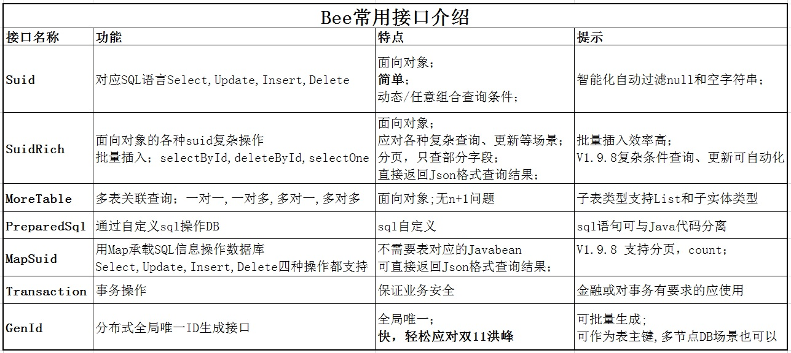

Bee
=========
#### 好消息:
**2022年5月1日(劳动节)**前登记的企业用户，可获得专业的生产环境使用帮助,为你的系统保驾护航、提高性能；  
个人用户登记后入群，可获得个性化的使用咨询!  
登记地址：  
https://gitee.com/automvc/bee/issues/I3PIUJ  
https://github.com/automvc/bee/issues/43  

**完成登记的伙伴,请加QQ群(992650213),找群主领资料!**  

#### 工欲善其事必先利其器！——《论语·卫灵公》  
#### 为适应互联网时代软件需求量大,需求变更频繁,性能要求高等要求,ORM Bee应运而生!

**Bee**，互联网新时代的Java ORM框架，更快、更简单、更自动，开发速度快，运行快，更智能!  
**Bee**，一个简单，易用，功能强大(编码少、开发速度快，运行快）的 JAVA ORM 框架。  
**Bee简单易用**：单表操作、多表关联操作，可以不用写sql,极少语句就可以完成SQL操作；**概念简单**,10分钟即可入门。  
**Bee功能强大**：复杂查询也支持向对象方式，分页查询性能更高，一级缓存即可支持个性化优化；具有分布式特性。高级要求，还可以方便自定义SQL语句。运行速度接近直接用JDBC的速度。  
**如果说Mybatis在Hibernate之后不是重复造轮子,那Bee在Hibernate和Mybatis之后也不会是重复造轮子!**  
择其优点，避其缺点，此外，还加有自己的优点！  

#### 磨刀不误砍柴工！    Bee连磨刀的时间都帮你省了。  
**Bee** 是一个具有人工智能(**AI**)特性，**省时/优雅、简易、自动**( **AiTea:** Timesaving/Tasteful, Easy, Automatic) 的ORM软件框架(AiTeaSoft)(IT-->AiTea 的思维转变!)。
  
Bee是一种更接近SQL语言思维的ORM框架，  
一种开发速度和开发成本都不比Php,Ruby on Rail差的Java ORM框架，  
而且它的编码复杂度是O(1)，即用了Bee，**无论多少个表**,你都可以不用另外再写dao代码；**让你可以更专注业务逻辑的开发**。  

**Bee** 网址:  
https://github.com/automvc/bee  
**Bee在gitee** 的网址:  
https://gitee.com/automvc/bee

## 环境要求  
jdk1.7+

## Bee主要功能特点介绍：  
**Bee概念简单**(10分钟即可入门)、功能强大。  
Bee **简化了与DB交互的编码**工作量.连接，事务都可以由Bee框架负责管理。  
### 省时,开发速度快
#### 简单易用
* 1.**接口简单，使用方便**。Suid接口中对应SQL语言的select,update,insert,delete操作提供**4个同名方法**。  
* 2.使用了Bee,你可以不用再另外编写dao代码，直接调用Bee的api即可完成对DB的操作。  
* 3.**约定优于配置**:Javabean没有注解,也不需要xml映射文件,只是纯的Javabean即可,甚至get,set方法不用也可以。  
* 4.**智能化自动过滤**null和空字符串，不再需要写判断非空的代码。  
* 5.支持**只查询一部分字段**。   
#### 自动,功强强大
* 6.**动态/任意组合**查询条件,不需要提前准备dao接口,有新的查询需求也不用修改或添加接口。  
* 7.支持原生SQL排序, **原生语句分页**(不需要将全部数据查出来)。  
* 8.支持**直接返回Json**格式查询结果; 链式编程。  
* 9.支持**事务**、多个ORM操作使用同一连接、**for update**，支持**批处理**操作，支持原生SQL(**自定义sql**语句)，支持**存储过程**。
* 10.支持面向对象方式复杂查询、**多表查询**(无n+1问题; 支持：一对一,一对多,多对一,多对多;返回结果根据子表是否使用List有两种呈现结构)。 
* 11.**一级缓存**，概念简单，功能强大；一级缓存也可以**像JVM一样进行细粒度调优**；**支持可更新的长久缓存列表**，更新配置表，**不需要重启**。天生抵御缓存穿透 。 
    **二级缓存扩展支持;Redis二级缓存支持**。  
* 12.表名与实体名、字段名与属性名映射默认提供多种实现，且支持**自定义映射规则扩展**。  
* 13.**多种DB**支持轻松扩展(MySQL,MariaDB,Oracle,H2,SQLite,PostgreSQL,SQL Server,**Cassandra**等直接可用),理论上支持JDBC的DB都可以支持。 
* 14.支持**读写分离**一主多从, 仅**分库**等**多数据源**模式(对以前的代码无需修改,该功能对代码是透明的,即无需额外编码);Jndi数据源支持。  
* 15.**支持同时使用多种数据库(如同时使用Mysql,Oracle,SQL Server)**。
* 16.提供自然简单的分布式主键生成方案:**分布式**环境下生成**连续单调递增**(在一个workerid内),**全局唯一**数字**id**。  
* 17.**支持同库分表,动态表名映射**。  
* 18.**拦截器、多租户,支持自定义TypeHandler,处理查询的ResultSet结果**。    
* 19.**Suid,SuidRich,PreparedSql,MapSuid,MoreTable支持设置数据源名称**。  
* 20.可以不用表对应的Javabean也能操作DB。  
* 21.**无**第三方插件依赖；可零配置使用。  
* 22.**性能好:接近JDBC的速度；文件小：Bee V1.8 仅217k**, **V1.9.5 仅315k，V1.9.8 仅310k**。  
**辅助功能**:  
* 23.支持自动生成表对应的Javabean，根据Javabean创建表，Javaweb**后端代码**根据**模板自动生成**；能打印非占位符的**可执行sql**,方便调试;支持生成Json格式的SQL脚本。  
* 24.支持**读取Excel**,从Excel导入数据到DB，操作简单。  
* 25.流的工具类StreamUtil。  
* 26.复杂查询前后端可自动解析。  
* 27.注解支持:PrimaryKey,Datetime,Createtime,Updatetime;JustFetch,ReplaceInto(MySQL)。  
* 28.可扩展注解:多租户,敏感信息模糊处理,自动设置字段值,Dict字典转化,DictI18n多语言国际化字典转化,Column列名与属性名映射。  

## 最新功能介绍: 

**V1.11**  
V1.11.0.1.1(**2022新年版**)  
SuidRich增加方法:  
  public <T> long insertAndReturnId(T entity,IncludeType includeType);  
PreparedSql增加方法:  
  public <T> List<T> select(String sql,T returnType);  
增加声明主键支持:  
  add annotation PrimaryKey  
  MapSqlKey support PrimaryKey  
可用BF代替BeeFactoryHelper加快输入  
增强:读写模式配置信息去除空格  
fix a bug for naming transfer  

V1.11.0.2.1(**2022春节版**)  
拦截器、多租户  
add Interceptor,InterceptorChain  
add DefaultInterceptor,CommInterceptorChain,DefaultInterceptorChain  

V1.11.0.2.4(**2022北京冬奥会版**)  
二级缓存扩展支持  
Redis缓存支持  
add BeeExtCache,DefaultBeeExtCache  
add BeeExtRedisCache  

V1.11.0.2.15(**2022元宵节版**)  
添加注解:Datetime,Createtime,Updatetime;JustFetch  
添加Jndi数据源支持  
检测MapSqlKey的值  

V1.11.0.2.20(**荣耀**)  
multi-DS同时使用不同类型DB优化  
支持同时使用多种数据库(如同时使用Mysql,Oracle,SQL Server)  
PreparedSql(自定义sql),MapSuid:拦截器，多数据源支持  
Suid,PreparedSql,MapSuid支持设置数据源名称,获取拦截器链  
Suid,PreparedSql,MapSuid,MoreTable增加方法:setDataSourceName,getDataSourceName,getInterceptorChain  
增加注解:  
AnnotationHandler,AutoSetString自动设置字符值  
Desensitize,敏感信息模糊处理  
ReplaceInto,MySQL replace into转换  
MultiTenancy多租户  
BeforeReturnAnnotationHandler,AbstractDictI18nDefaultHandler  
Dict字典转化  
DictI18n多语言国际化字典转化  

V1.11.0.2.28  (**Special Day**)  
增加ShardingStruct为分库分表作准备  
Column列名与属性名映射扩展支持  
支持自定义TypeHandler,处理查询的ResultSet结果  
PreparedSql自定义sql支持多表查询,返回多表关联Javabean结构数据  
fixed bug:  
多表查询同一个实体自我关联查询禁止自我多次循环  

V1.11.0.3.8  (**Lady First**)  
增加SetParaTypeConvert转化PreparedStatement参数.  
Javabean使用java.util.Date类型,进行SUID作兼容处理.  
SQLite获取Timestamp结果作转化处理.  
实体属性是Javabean与DB表Json类型字段在参数设置与查询结果时自动转换(使用Json注解自定义实现).  

V1.11.0.3.12  (**植树节版**)  
Ddl.java使用Javabean创建表,支持追加java与db字段类型映射,支持设置某个DB的java_dbtype类型映射.  
Ddl.java兼容原生char类型,兼容java.util.Date.  
PreparedSql自定义sql支持批量插入.  
支持在Suid等对象设置命名转换器.  
增加DbFeature方言注册器,自定义实现不同DB方言更加易用.  
支持Cassandra.  
showExecutableSql添加List,Set,Map,UUID支持.  

V1.11.0.3.20  (**春分**)  
自定义动态SQL标签,@in,@toIsNULL1,@toIsNULL2,&lt;if isNotNull>,&lt;if isNotBlank>.  
动态sql,将list转为像in (1,2,3)的语句,不需要foreach,批量插入也不需要foreach.  


## [详细完整功能介绍](../../../bee/blob/master/Changed_Log_CN.md)  
[点击链接可查看  详细完整功能介绍](../../../bee/blob/master/Changed_Log_CN.md)  

## ORM比较	

[ORM-Compare (More Detail)](../../../orm-compare)  

测试环境: Windows.  
数据库: MySQL (Version 5.6.24).  
测试点: 批量插入;分页查询;事务(update and select).  

  

<table cellspacing="0" cellpadding="0">
  <col width="62" />
  <col width="69" />
  <col width="64" />
  <col width="69" span="2" />
  <col width="96" />
  <tr height="19">
    <td colspan="6" height="19" width="429"><div align="center">批量插入(单位: ms)</div></td>
  </tr>
  <tr height="19">
    <td height="19">　</td>
    <td>5k</td>
    <td>1w</td>
    <td>2w</td>
    <td>5w</td>
    <td>10w</td>
  </tr>
  <tr height="19">
    <td height="19">Bee</td>
    <td align="right">529.00 </td>
    <td align="right">458.33 </td>
    <td align="right">550.00 </td>
    <td align="right">1315.67 </td>
    <td align="right">4056.67 </td>
  </tr>
  <tr height="19">
    <td height="19">MyBatis</td>
    <td align="right">1193</td>
    <td align="right">713</td>
    <td align="right">1292.67 </td>
    <td align="right">1824.33 </td>
    <td>Exception</td>
  </tr>
</table>

<p>&nbsp;</p>
<table cellspacing="0" cellpadding="0">
  <col width="62" />
  <col width="69" />
  <col width="64" />
  <col width="69" span="2" />
  <col width="96" />
  <tr height="19">
    <td colspan="6" height="19" width="429"><div align="center">分页查询(单位: ms)</div></td>
  </tr>
  <tr height="19">
    <td height="19">　</td>
    <td align="right">20次</td>
    <td align="right">50次</td>
    <td align="right">100次</td>
    <td align="right">200次</td>
    <td align="right">500次</td>
  </tr>
  <tr height="19">
    <td height="19">Bee</td>
    <td align="right">17.33 </td>
    <td align="right">58.67 </td>
    <td align="right">52.33 </td>
    <td align="right">38.33 </td>
    <td align="right">57.33 </td>
  </tr>
  <tr height="19">
    <td height="19">MyBatis</td>
    <td align="right">314.33 </td>
    <td align="right">446.00 </td>
    <td align="right">1546.00 </td>
    <td align="right">2294.33 </td>
    <td align="right">6216.67 </td>
  </tr>
</table>

<p>&nbsp;</p>
<table cellspacing="0" cellpadding="0">
  <col width="62" />
  <col width="69" />
  <col width="64" />
  <col width="69" span="2" />
  <col width="96" />
  <tr height="19">
    <td colspan="6" height="19" width="429"><div align="center">事务(update and select) (单位: ms)</div></td>
  </tr>
  <tr height="19">
    <td height="19">　</td>
    <td align="right">20次</td>
    <td align="right">50次</td>
    <td align="right">100次</td>
    <td align="right">200次</td>
    <td align="right">500次</td>
  </tr>
  <tr height="19">
    <td height="19">Bee</td>
    <td align="right">1089.00 </td>
    <td align="right">70.00 </td>
    <td align="right">84.00 </td>
    <td align="right">161.33 </td>
    <td align="right">31509.33 </td>
  </tr>
  <tr height="19">
    <td height="19">MyBatis</td>
    <td align="right">1144</td>
    <td align="right">35</td>
    <td>79.67 </td>
    <td align="right">146.00 </td>
    <td align="right">32155.33 </td>
  </tr>
</table>
	
**Bee需要的文件**   
orm\compare\bee\service\BeeOrdersService.java	

**Mybatis需要的文件**(对一个表的操作,就会比Bee多三个dao相关文件)   
orm\compare\mybatis\service\MybatisOrdersService.java	
orm\compare\mybatis\dao\OrdersDao.java	
orm\compare\mybatis\dao\OrdersMapper.java	
orm\compare\mybatis\dao\impl\OrdersDaoImpl.java	

公共都需要的有,Javabean和Service接口:  
Orders.java  
OrdersService.java  

**用Bee无需用户再写Dao代码，一个表少三个Dao文件，100个表就少300个Dao文件.**	
	
快速开始:
=========	
## 1. 引入Bee  
#### 1.1 maven工程,添加如下依赖  

```xml
		<dependency>
			<groupId>org.teasoft</groupId>
			<artifactId>bee</artifactId>
			<version>1.9.8</version>
		</dependency>
		<dependency>
			<groupId>org.teasoft</groupId>
			<artifactId>honey</artifactId>
			<version>1.9.8</version>
		</dependency>
		<!--for log framework,Excel(poi) -->
		<dependency>
			<groupId>org.teasoft</groupId>
			<artifactId>bee-ext</artifactId>
			<version>1.9.8</version>
		</dependency>
```

#### 1.2  也可以直接下载jar文件  	
		
## 2. 创建数据库和表  

举例如下:  
创建一个数据库,默认名称为bee.  
可以用[init-data(user-orders)-mysql.sql](../../../bee-exam/blob/master/src/main/resources/init-data(user-orders)-mysql.sql)脚本创建表和插入初始化数据.  

## 3. 更新数据库的配置信息(在bee.properties)  
注:如果还没有bee.properties文件,可以自己新建一个.  
也可以配置数据源(此处只是一个例子).  

\#bee.databaseName=MySQL  
bee.db.dbName=MySQL  
bee.db.driverName = com.mysql.jdbc.Driver  
\#bee.db.url =jdbc:mysql://localhost:3306/bee?characterEncoding=UTF-8  
bee.db.url =jdbc:mysql://127.0.0.1:3306/bee?characterEncoding=UTF-8&useSSL=false  
bee.db.username = root  
bee.db.password =  

## 4. 生成Javabean Orders可参考:  
[Orders(Javabean)](../../../bee-exam/blob/master/src/main/java/org/teasoft/exam/bee/osql/entity/Orders.java)  
[自动生成Javabean](../../../bee-exam/blob/master/src/main/java/org/teasoft/exam/bee/osql/autogen/GenBeanExam.java)  

## 5. 运行下面的 java代码    

```java
		
import java.math.BigDecimal;
import java.util.List;

import org.teasoft.bee.osql.Suid;
import org.teasoft.honey.osql.core.BeeFactoryHelper;

/**
 * 查,改,增,删 Suid (select,update,insert,delete)实例
 * @author Kingstar
 * @since  1.0
 */
public class SuidExam {
	
	public static void main(String[] args) {

		Suid suid=BeeFactoryHelper.getSuid();
		
		//需要先生成相应的Javabean
		Orders orders1=new Orders();
		orders1.setId(100001L);
		orders1.setName("Bee(ORM Framework)");
		
		//1:select查询实例
		//默认不处理null和空字符串.不用再写一堆的判断;其它有值的字段全部自动作为过滤条件
		List<Orders> list1 =suid.select(orders1);  //select
		for (int i = 0; i < list1.size(); i++) {
			System.out.println(list1.get(i).toString());
		}
		
		//2:update更新实例
		orders1.setName("Bee--ORM Framework");
		//默认只更新需要更新的字段. 过滤条件默认只用id字段,其它需求可用SuidRich中的方法.
		int updateNum=suid.update(orders1);   //update
		System.out.println("update record:"+updateNum);
		
		
		Orders orders2=new Orders();
		orders2.setUserid("bee");
		orders2.setName("Bee(ORM Framework)");
		orders2.setTotal(new BigDecimal(91.99));
		orders2.setRemark("");  //empty String test
		
		//3:insert 插入实例
		int insertNum=suid.insert(orders2); //insert  		
		//默认不处理null和空字符串.不用再写一堆的判断;其它有值的字段全部自动插入数据库中. 
		//方便结合DB插值,如id自动增长,由DB插入;createtime由DB默认插入
		System.out.println("insert record:"+insertNum);
		
		//4:delete 删除实例
		//默认不处理null和空字符串.不用再写一堆的判断;其它有值的字段全部自动作为过滤条件
		//int deleteNum=suid.delete(orders2);   //delete
		//System.out.println("delete record:"+deleteNum);
		
	}
}
//注意: 事务,分页,排序,范围查询,查询结果直接返回json等都支持,这里只是一个入门例子.
//更加应用参考,请查看: 更多例子   和    综合应用 .

```

#### [更多例子/测试用例](../../../bee-exam/)	

#### [Bee+Spring-boot Demo](../../../bee-starter-demo/)	

### API-DOC  
[API-V1.9.5](https://gitee.com/automvc/bee/attach_files/692020/download)

API-V1.9.8(最新版) 下载代码含有 bee-1.9.8-javadoc.zip  

### Bee架构介绍  
  

### Bee常用接口介绍  
  

综合应用:
=========	
**Java快速编程, 让Java的开发速度超过php和Rails。**  

**更快的开发Java Web的新组合：**  
[Bee+Spring+SpringMVC](../../../../aiteasoft/bee-spring-springmvc)  
**包括仅分库多数据源实例**	

[Bee+Spring+SpringMVC开发学校教务管理与分数管理系统](../../../../aiteasoft/schoolsys)  

**更快的开发Spring Cloud微服务的新组合：**  
[Bee + Spring Boot](../../../bee-springboot)  

......  

## [FAQ常见问题](../../../bee/blob/master/FAQ_CN.md)  
[点击链接可查看  FAQ常见问题](../../../bee/blob/master/FAQ_CN.md)  

其它学习资料:
=========	
[wiki 文档](../../../bee/wikis)  

[CSDN: ORM Bee资料大全](https://blog.csdn.net/abckingaa/article/details/121664398)
  
联系与欢迎:
=========	
#### 作者的电子邮箱email:    honeysoft@126.com  
#### 如有任何相关建议,欢迎给作者发邮件,不胜感激!  
#### 更多设计思想,请关注微信公众号: 软件设计活跃区  


#### 为了能及时解答大家的疑问，可以加入Bee的技术QQ群：992650213

#### 同时,也欢迎你加入到Bee框架的开发之中,相信有你的加入,Bee会更加美好! 
